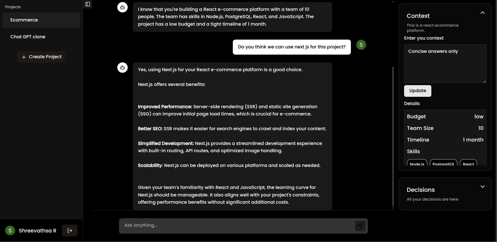
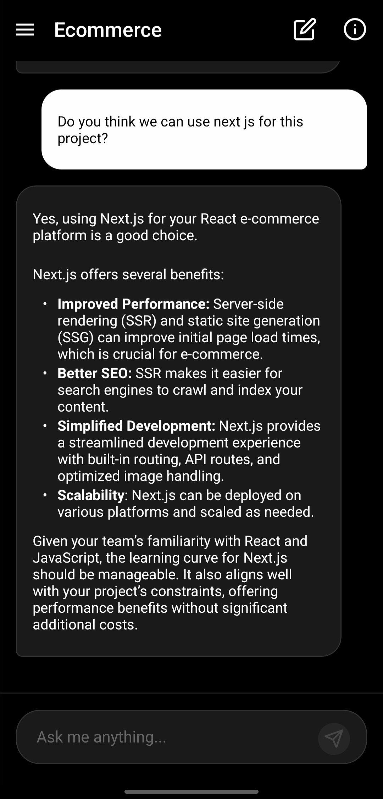
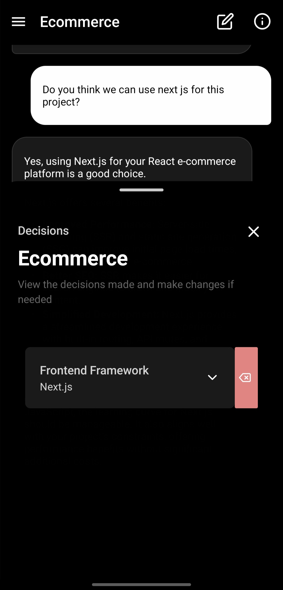
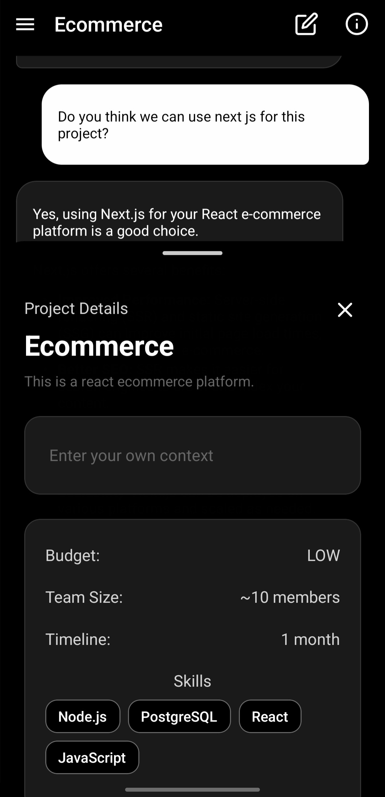
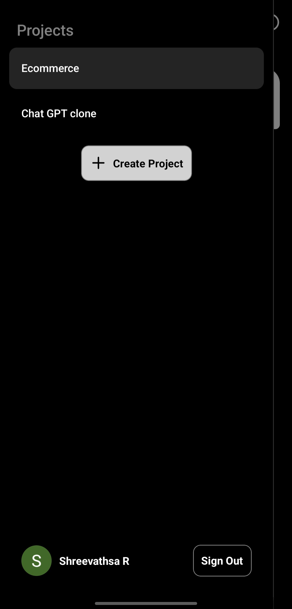

# DevPlanner – AI-Powered Chat Based Project Planning Assistant

PlanDev is a cross-platform AI assistant that helps developers plan and architect software systems using structured, context-aware LLM conversations. Built with a monorepo structure powering both a mobile app (React Native) and web app (Next JS), PlanDev turns vague project ideas into clear, categorized, and structured decisions.

> “Chat with an AI and walk away with a concrete tech plan — stack choices, architecture, and rationale included.”

---

## 🚀 Features

- 🔒 **Authenticated Project Workspace**  
  Login with Firebase Auth and manage multiple planning projects securely.

- 💬 **AI-Powered Decision Making**  
  Uses Google Gemini API to extract decisions like architecture, frontend/backend stack, database, etc.

- 📂 **Project Metadata Management**  
  Define project description, timeline, team size, budget, and custom AI context per project.

- 📚 **Structured Decision Storage**  
  Auto-generated decisions are categorized (e.g., Frontend, Infra, Database) and shown with reasoning for every choice.

- 🎯 **Context + Style Customization**  
  Choose the tone and verbosity of AI responses to fit your preferred decision style.

- 📱 **React Native Mobile App**  
  Fast drawer-based navigation to jump between chat, project info and past decisions bottom sheets.

- 🌐 **Web Interface**  
  Built on the same shared tRPC API layer; web UI in progress using existing queries/mutations.

- 🔗 **One-Click Shareable Link** (WIP)  
  Generate a public read-only link to your planning document.

---

## 🛠 Tech Stack

| Layer        | Tech                                                     |
| ------------ | -------------------------------------------------------- |
| Frontend     | Next JS, React Native, Tailwind CSS, Zustand, React Query |
| Backend      | Next JS, tRPC, Redis, Firebase Auth, Gemini API     |
| Database     | PostgreSQL (via Prisma ORM)                              |
| Validation   | Zod                                                      |
| Architecture | Monorepo with Shared Packages                            |

---

## 📸 Screenshots

### 🖥️ Web App – Decision View


### 📱 Mobile App – AI Chat + Decision Rendering

<div align="center">
  
  
  
  
</div>

---

## 🔧 Project Structure

```bash
devplanner/
├── apps/
│   ├── web/           # Next.js (React) web client
│   └── mobile/        # React Native mobile app
│
├── packages/
│   ├── trpc/           # tRPC routers, procedures, API types
│   ├── prisma/            # Prisma schema, database client, seed scripts
│   └── schema/         # Shared Zod validators, context transformers, helpers
│
└── README.md          # You're reading this
```

---

## 📅 Roadmap

- [x] AI chat with Gemini API + function calling
- [x] Project metadata creation/edit
- [x] Structured decision extraction & UI rendering
- [x] Firebase Auth with protected routes
- [x] Shared API logic (tRPC) across web and mobile
- [ ] Markdown export
- [ ] One-click public link generation
- [ ] Web UI polish and deployment
- [ ] Plan forking functionality (post-MVP)

---

## 🧠 Inspiration

Built out of frustration with messy Notion docs and ad-hoc architectural decisions — PlanDev gives devs a clean, AI-assisted way to start projects right.

---

## 📄 License

MIT — free for personal use.
